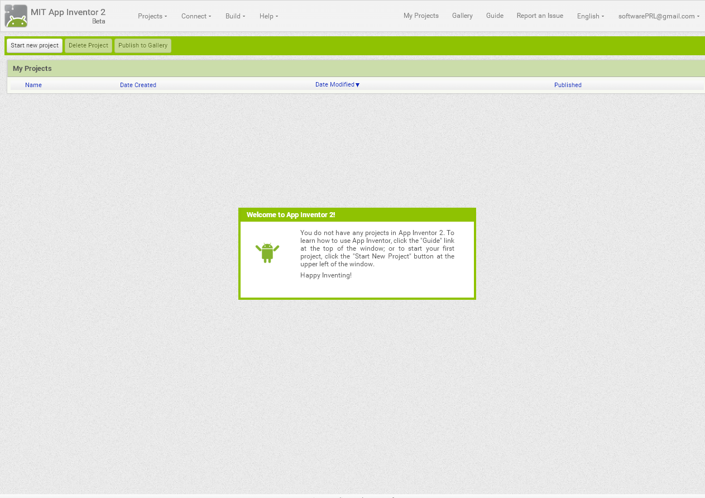

MIT App Inventor ([Parte 1](https://www.youtube.com/watch?v=Elv0T-g9cKg))

**Introducción**

App inventor es un framework creado inicialmente por el MIT (Instituto tecnológico de Massachusetts) y fue conseguido por Google, para que cualquier persona con interés pueda crearse su propia aplicación móvil, ya sea para su empresa, para su casa o por otros intereses.

El editor de bloques de la plataforma App Inventor, utiliza la librería Open Blocks de Java para crear un lenguaje visual a partir de bloques.

Esta herramienta de desarrollo usa modo gráfico donde solo con agregar una serie de propiedades al objeto podrá realizar el trabajo sin necesidad de saber programar. El usuario puede enlazar una serie de bloques para crear la aplicación de forma visual partiendo de elementos  y componentes básicos.

**_VENTAJAS:_**

* MIT App Inventor permite crear una aplicación en una hora o menos, y se pueden programar aplicaciones más complejas en mucho menos tiempo que con los lenguajes más tradicionales.

* Permite crear aplicaciones por medio de bloques de manera intuitiva y grafica, sin necesidad de saber código de programación.

* Se puede acceder en cualquier momento y cualquier lugar siempre que estemos conectados a internet a nuestros proyectos.

* Nos ofrece varias formas de conectividad: directa, o wi fi o por medio del emulador como mejor nos parezca.

* Nos permite descargar la aplicación mediante el .apk a nuestro pc ya sea para compartirla o instalarla en nuestro celular.

**_DESVENTAJAS:_**

* No genera el código Java para posteriores desarrollos más profundos. (Aunque hay una versión nueva que convierte el proyecto en un código legítimo)

* Solo funciona con conexión a Internet.

* Solo se puede desarrollar para Android.

**Modo de uso**

Es muy importante conocer en entorno gráfico y lo que nos puede ofrecer para realizar la aplicación.

Para empezar a usar App Inventor necesitamos entrar en: [http://ai2.appinventor.mit.edu/](http://ai2.appinventor.mit.edu/)

Si no somos usuarios en esta plataforma nos pedirá que iniciemos la sesión con nuestra cuenta de Google. Lo siguiente que necesitaremos es:

* Crear [cuenta gmail](https://www.google.com.ar/url?sa=t&rct=j&q=&esrc=s&source=web&cd=2&cad=rja&uact=8&ved=0ahUKEwj_7pfH_p3XAhWBkZAKHekQD_kQFgg8MAE&url=https%3A%2F%2Faccounts.google.com%2FSignUp%3Fhl%3Des-419&usg=AOvVaw00bvx3A4QNpzAjmi7Nhs_f) o usar una existente

* Instalar emulador: [http://appinventor.mit.edu/explore/ai2/setup-emulator.html](http://appinventor.mit.edu/explore/ai2/setup-emulator.html) (Opcional)

* Instalar [MIT AI2 Companion](https://play.google.com/store/apps/details?id=edu.mit.appinventor.aicompanion3&hl=es_419) (Emulador para Android)

Para comenzar un nuevo proyecto simplemente le damos al botón **_"Crear un proyecto nuevo" _**o **_“Start new project”_** según el idioma que le asignemos a la plataforma, para cambiar el idioma tienes que elegir uno de la lista desplegable que está en el borde superior derecho, al lado de nuestra cuenta logeada.

A continuación se ilustran los componentes disponibles en cada uno de estos en el panel izquierdo de la plataforma:

**INTERFAZ DE USUARIO:**

Acá podemos apreciar el reloj, agregar imágenes, escribir texto, configurar cuadros para contraseñas, etc.

**DISPOSICIÓN:**

También llamado componentes Alineamiento de pantalla, donde los elementos se pueden manejar y tabular en cualquier posición.

**MEDIOS:**

Estos componentes multimedia nos permiten tener acceso a los videos, sonidos, reproductor de música, etc.

**DIBUJOS Y ANIMACIÓN:**

Estos elementos interactúan de forma dinámica con los objetos dentro de la aplicación.

**SENSORES:**

Son estos que reciben información de ubicación, siente las sacudidas del teléfono, muestra la orientación espacial del teléfonos, entre otros.

**SOCIAL:**

Son estos elementos que nos permiten interactuar con otros usuarios, o simplemente buscar información de un contacto.

**ALMACENAMIENTO:**

Permite la comunicación con servidores Web para almacenar y recuperar información, funciones HTTP, GET y post, etc.

**CONECTIVIDAD:**

Muestra una búsqueda en la web, así como la transferencia mediante Bluetooth.

**NOTA:**

Para crear uno de estos componentes, simplemente escogemos el que necesitamos y lo arrastramos al área de trabajo, y modificamos las propiedades según nuestro gusto y la necesidad de nuestro proyecto.

Una vez que entendimos la composición de la interfaz, proseguimos a comenzar un nuevo proyecto.

Antes de nada, para este ejercicio necesitamos dos recursos que tenemos que descargar en nuestro ordenador:

-[Una imagen de un gatito](https://www.google.com.ar/search?q=Gatito&client=firefox-b-ab&dcr=0&source=lnms&tbm=isch&sa=X&ved=0ahUKEwiukpLhgp7XAhWIHJAKHQhvCv4Q_AUICigB&biw=1366&bih=643) (En lo posible, el más tierno)

-[Un sonido gatuno](http://www.sonidosmp3gratis.com/sounds/animals021.mp3) (Puede ser un ronroneo)

Una vez que tengamos los dos recursos, proseguimos a incluir un botón en la pantalla:

En la parte izquierda hacemos click en el componente **"BOTÓN"** y sin soltar arrastramos hasta el **“VISOR”**.

Ahora, lo que queremos lograr es que nuestro gatito aparezca en la pantalla. Para que el botón tenga la imagen, hacemos click en el botón, y en el panel derecho de App Inventor, en propiedades, y bajo la propiedad **"IMAGEN"**, hacemos click en **“NINGUNO”** eligiendo la opción **_“Subir Archivo”_** donde seleccionaremos a nuestro Michi.

Podremos ver al gato como imagen del botón, que ahora será más grande.

Para quitar el texto para el **"Botón1"** que aparece por debajo del gato hay que borrar el valor de la propiedad **“Texto del botón”**, en la parte derecha de la ventana. Luego debemos cambiar los valores de las propiedades **“Ancho”** y **“Alto”** del botón por **“Ajustar al contenedor”**, así se ajusten al tamaño máximo de la pantalla.

Ahora añadiremos un sonido a nuestra aplicación, arrastrando hasta el visor el icono **"Sonido"**, que está dentro del grupo **“Medios”**, en la Paleta.

Este objeto no se verá en el móvil o en el emulador, porque no es una imagen, botón, o etiqueta.

En el Panel de Propiedades, seleccionamos la propiedad **"ORIGEN"** del componente **“Sonido1”** y subiremos el archivo.

Con esto hemos terminado de diseñar el aspecto de nuestra aplicación Ahora viene la magia, tenemos que programar cómo se comportará la aplicación. ¡Eso es programar!
