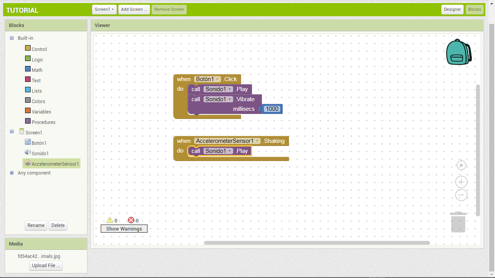

MIT App Inventor ([Parte 2](https://www.youtube.com/watch?v=Dr6ZX-9uXb8))

Este botón abre la ventana de programación con bloques. La parte más amplia, es el Editor, donde colocaremos los bloques de nuestros programas.

Vamos a hacer que suene el sonido del gato cada vez que hagamos clic sobre él.

Para eso hacemos clic en "Botón1" lo que nos mostrará los bloques de colores disponibles para escribir nuestro código.

Arrastramos hasta el editor el bloque que dice "When Botón1.Clic"

Los bloques naranjas son los gestores de sucesos​. Indican qué hay que hacer cuando sucede algo en la aplicación. En este caso, el gestor nos permitirá decirle al ordenador QUÉ debe hacer cuando hagamos clic sobre el gato.

Ahora hacemos clic sobre nuestro componente "Sonido1" ​para abrir su cajón. Entonces arrastramos la instrucción "Call.Sonido1.Play" hasta "encajarla" dentro del gestor que hemos creado para el botón.

ENORABUENA!

Ya podemos probarla en el móvil. Para instalarla permanentemente, como cualquier otra aplicación, podemos generar un código QR.

Para ello hacemos clic en Generar ​y elegimos la opción "App (generar código QR para el archivo .APK)"

Es preferible que tengas un lector de códigos QR a mano!

La aplicación quedará descargada entonces en nuestro Teléfono/Tablet, para ejecutarla siempre que queramos.

**MEJORANDO LA APLICACIÓN:**

Que tal si mejoramos la aplicación, haciendo que el teléfono vibre a la vez que el gato maúlla.

Una pista: hay que buscar dentro del cajón de bloques del componente **"****Sonido1​****"**

El bloque que hace que el móvil vibre es **"Call.Sonido1.Vibrate"**. Este bloque, a diferencia del anterior, tiene un **“encajador”** por el lado derecho. Sirve para indicar cuánto tiempo tiene que vibrar el dispositivo, en milisegundos.

Para poner aquí un valor de tiempo hay que abrir el cajón **"Matemáticas"** y arrastrar el bloque de arriba hasta el encajador libre a la derecha del bloque **“Call.Sonido1.Vibrate”**, ​donde indica milisegundos​.

Luego cambiamos el valor 0 por el valor 1000, para que vibre durante 1 segundo. Los bloques quedarán así:

Ahora volvemos al Diseñador y añadimos un componente **"Acelerómetro​"**, que se encuentra en la Paleta **“Sensores​”**. Se quedará bajo la ventana del visor, porque no es un componente visible en nuestra interfaz de usuario.

Una vez puesto el acelerómetro, en el editor de bloques elegiremos, en la ventana de bloques, el componente que hemos creado. De su cajón elegiremos el bloque naranja "When.Acelerómetro1.Shaking"

Luego duplicamos el bloque Call.Sonido1.Play de arriba, haciendo clic con el botón derecho sobre él y seleccionando Duplicar​.

Una vez duplicado lo encajaremos con el bloque naranja que hemos creado.

¿Qué va a ocurrir? Nuestro Michi también maullará cada vez que agitemos el móvil. El acelerómetro es el sistema que detecta que el móvil se mueve, o cambia de orientación vertical a horizontal.

Aquí hay dos EVENTOS distintos, y le estamos indicando al móvil, qué debe hacer cuando suceda cada uno de estos eventos. (EVENT-DRIVEN PROGRAMMING).

Intentemos ahora generar nosotros mismos el código QR para esta nueva aplicación.

Podemos entrar en la web de App Inventor haciendo clic en su icono de la esquina superior izquierda, y dar "un paseo" por los recursos que hay en la página de App Inventor.

Ahora para concluir, te dejaré esta tarea para que vayas familiarizandote con el entorno.

Mi nombre es *[Jonathan Hacklif*e](https://www.linkedin.com/in/jonathanhacklife/) y este fue el tutorial básico para conocer esta increíble herramienta.

Muchas gracias por llegar hasta el final!
