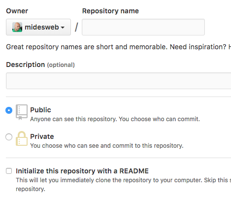

GIT

Link: [https://try.github.io](https://try.github.io)

Introducción

La manera más sencilla de pensar GIT es como una herramienta para compartir archivos. La misma está enfocada en código de programación, permitiendo compartir archivos entre muchos programadores.

¿Y porqué no lo mandamos por mail? ¿Y porqué no usar Google Drive?

Si bien conocemos estas herramientas y nos son intuitivas, a la hora de programar traen problemas que no son tan sencillos de resolver, como por ejemplo:

* Seguimiento de versiones

* Seguimiento de autoría

* Mezcla de cambio entre múltiples usuarios

* Bifurcación de proyectos

Estas son algunas de las ventajas que presenta GIT lo cual lo hace hoy en día un **estándar mundial**.

Entonces...¿Cómo funciona?

GIT es un repositorio online que va a guardar **todos** nuestros archivos y carpetas. Cada integrante del equipo se descargará una **copia** en su entorno de trabajo (local) e iremos sincronizando nuestra copia local con la versión que se encuentra online.

El proceso de **bajar los archivos actualizados** se lo llama **pull**. El proceso de **subir los archivos actualizados** se lo llama **push**.

Sin embargo, puede suceder que uno termine de trabajar aun estando offline y quiera seguir trabajando...Por eso (entre otras cosas) es que aparece la palabra **commit**. Un commit es un paquete de varios cambios "listos para ser subidos".

Visto desde una manera más lineal, uno empieza a trabajar en cierta funcionalidad, cuando termina, **hace un commit**. Uno puede seguir trabajando y así hacer muchos commits! (o commitear como se suele llamar). Sin embargo, el repositorio online aún no está  actualizado hasta que se haga un **push **(pushear), es decir enviar la funcionalidad desarrollada al repo general para que el resto del equipo también la tenga.

Es importante también aclarar qué archivos son parte del commit. A esto se lo llama **staging** o simplemente **add**. El **add** es el comando inicial que hay que hacer para que al commitear sean enviados. El comando **stage** por otro lado se usa por ejemplo cuando no se quiere pushear en ese momento pero no queres perder los cambios, entonces los stasheas (se guardan en algún lugar especial para cuando se quiera volver a recuperarlo)

Naturalmente, GIT se puede poner un poco más complejo pero estas son las ideas iniciales.

Uso

Para utilizar GIT uno tiene que hacer dos cosas

1. Como grupo es necesario crear el repositorio ONLINE. Para esto recomendamos plataformas como [Github](https://github.com/) o [BitBucket](http://www.bitbucket.com/)

Desde Github creas un repositorio con el botón "+" de arriba a la derecha. Obviamente tienes que haberte registrado en Github para comenzar. El registro es gratuito.

Apareces en una página para que indiques los datos del repositorio. Básicamente tienes que darle un nombre, elegir si es público o privado y opcionalmente una descripción. 

Una vez creado el repositorio tendremos una URL única como por ejemplo [https://github.com/dariosus/jsonProvincias](https://github.com/dariosus/jsonProvincias) que es la URL a nuestro repositorio online

2. Descargar y sincronizar nuestra copia local

Para esto existen vario programas para utilizar en nuestras computadoras. Las opciones recomendadas son:

    1. Utilizarlo desde la terminal (en Linux y Mac es muy sencillo de instalar. Para Windows se recomienda [Git Bash](https://git-for-windows.github.io/)). Es decir que se utiliza mediante líneas de comando.

    2. Utilizar una interfaz gráfica como [Github For Desktop](https://desktop.github.com/) o [GitKraken](https://www.gitkraken.com/)

Para aprender Github For Desktop recomendamos el siguiente video: [https://www.youtube.com/watch?v=QBA19ocMGQQ](https://www.youtube.com/watch?v=QBA19ocMGQQ)

Para aprender GitKraken recomendamos los siguientes videos:

[https://www.youtube.com/playlist?list=PLe6EXFvnTV78WqGmGSq8JPnafR3lAa55n](https://www.youtube.com/playlist?list=PLe6EXFvnTV78WqGmGSq8JPnafR3lAa55n)

Para aprender a usarlo desde la terminal recomendamos la siguiente sección del documento.

Tutorial #ManosEnLaMasa

Los invitamos a aprender desde [http://try.github.io/](http://try.github.io/) o desde [https://www.codecademy.com/es/learn/learn-git](https://www.codecademy.com/es/learn/learn-git)
