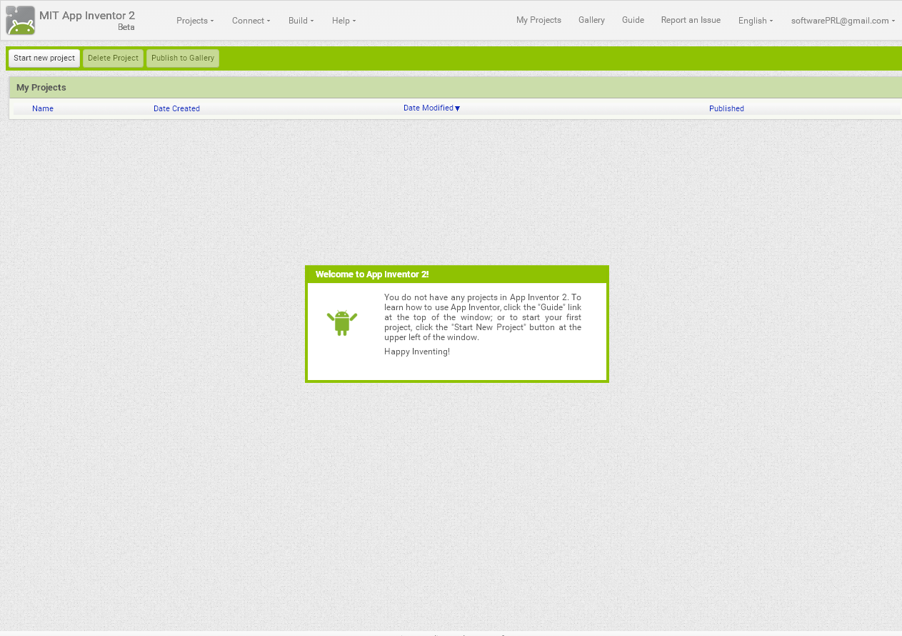

# Slack

Tutorial: [https://www.youtube.com/watch?v=U0ojxf1DZ-g](https://www.youtube.com/watch?v=U0ojxf1DZ-g)

Introducción

Slack es un canal de comunicación para comunicar equipos complejos permitiendo tomar temas en simultáneo de manera ordenada.

Dicho de otra manera, Slack es simplemente un chat en vivo. La peculiaridad de Slack es que permite tener espacios de trabajo. Por ejemplo: Developers For Good tiene su propio espacio de Slack y todas las comunicaciones en ese espacio pueden ser vistas únicamente por sus miembros.

Dentro de Slack uno puede:

* Enviar mensajes privados (individuales)

* Crear canales públicos (cualquier persona en el Slack de D4G podría sumarse)

* Crear canales privados (uno solo puede sumarse con invitación)

De esta manera podrían, por ejemplo, existir un canal público llamado **General** en donde se discutirán cuestiones del evento mientras podría haber un canal **Almuerzo** para discutir cuestiones peculiares sobre la comida. Al ser canales públicos, cualquier persona interesada puede sumarse en el canal.

Distinto sería si existiese un canal privado **Staff**. Para sumarse a ese canal uno debería recibir una invitación.

Como usuario, uno puede crear tantos canales como uno quiera aunque ¡no generemos sobrepoblación de canales!

Slack es prolijo y a su vez permite realizar conexiones con otras aplicaciones lo cual lo hace sumamente poderoso.

Uso

Existen espacios de Slack a los que uno puede simplemente unirse y otros a los que uno requiere una invitación. En el caso de D4G uno simplemente debe registrarse en [https://slack.developersforgood.com](https://slack.developersforgood.com)

Tras ingresar tu mail, va a llegar un mail de bienvenida. Una vez ya registrado simplemente puedes volver desde [https://developersforgood.slack.com](https://developersforgood.slack.com)

Este tutorial va a estar enfocado en la interfaz web pero muy similar será en el teléfono.

Del lado izquierdo encontrarás los espacios de conversación.

Clickeando en distintas personas o en distintos canales podes cambiar el espacio de la conversación. Si quieres enviarle un mensaje a una persona que no veas o en un canal que no ves inmediatamente podes clickear en el **+** y buscar el espacio apropiado. Desde este botón también podrás crear canales.

El espacio de conversación es más sencillo...¡es simplemente un chat!

Tutorial #ManosEnLaMasa

Al ingresar por primera vez a Slack, la misma plataforma ofrece un tutorial.

Si no lo viste, podes abrir la conversación con **slackbot** (un robot de Slack mismo) y conversarle. El mismo robot brindará las respuestas a lo que necesites.

En el peor de los casos, siempre podes acceder al [centro de ayuda](https://get.slack.help/hc/es)
